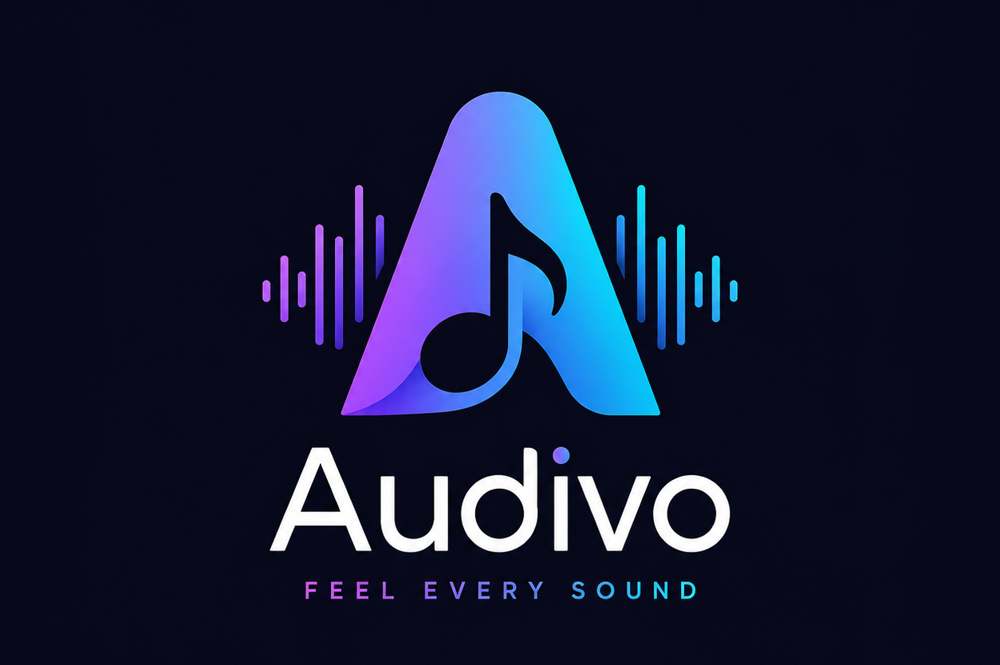

<p align="center">
  
</p>

<h3 align="center">FEEL EVERY SOUND</h3>

<p align="center">
  Offline-first PWA music player. Upload, play, download from YouTube, create playlists.<br>
  Fully client-side, no backend, no tracking.
</p>

<p align="center">
  <a href="https://github.com/bloggermohiuddin/music"></a>
  <a href="https://github.com/bloggermohiuddin/music/network/members"></a>
  <a href="https://github.com/bloggermohiuddin/music/issues"></a>
  <a href="https://github.com/bloggermohiuddin/music/blob/main/LICENSE"></a>
</p>

---

## Features

### Core
- **SPA Architecture** — No page reloads. History API navigation with pushState. Browser refresh preserves current route.
- **Offline-First** — All songs stored as blobs in IndexedDB. Service Worker caches everything. Works in airplane mode.
- **Installable PWA** — Web App Manifest, Service Worker, standalone mode, lock screen controls.
- **5 Themes** — Dark, Pure Black OLED, Light, Glassmorphism, Neon.

### Music Library
- Upload MP3, M4A, WAV, AAC, OGG, FLAC
- Automatic metadata extraction (title, artist, album, duration, embedded thumbnail)
- Drag-and-drop upload support
- Duplicate detection
- Grid / List / Artist view with sorting (date, title, artist, duration)
- **Now playing indicator** — animated bars on currently playing song
- **Edit song details** — rename title, artist, album, change thumbnail
- **Single song delete** — right-click context menu or long-press
- **Batch select** — multi-select and delete multiple songs at once

### YouTube Download
- Paste YouTube or YouTube Music links
- API integration → direct MP3 → blob → IndexedDB
- Thumbnail caching
- Persistent offline storage
- Download queue with progress tracking
- **Cancel download** — abort any in-progress download

### Audio Player
- Play / Pause / Stop / Seek / Volume / Mute
- Playback speed (0.5x – 2x)
- Repeat modes: none, all, one
- Shuffle
- **Shuffle All** — shuffle entire library into queue
- Queue system with autoplay
- **Queue drag reorder** — drag songs to rearrange queue
- **Sort queue A–Z** — sort queue alphabetically
- **Play Next** — insert song right after current track
- Waveform visualizer (Web Audio API)
- Crossfade (0–12 seconds)
- Fade in / Fade out
- **Sleep timer in player** — presets (5/10/15/30/45/60 min) + custom input (1–480 min) with live countdown
- Media Session API (lock screen controls)

### Playlist System
- Create, rename, delete playlists
- Add/remove songs
- Play all
- Song count tracking

### Context Menu
- Right-click (desktop) or long-press (mobile 400ms) any song
- Play, Play Next, Add to Queue, Add to Playlist, Favorite, Share, Edit Details, Delete

### Search
- Real-time instant search by title, artist, album
- Debounced input

### Storage Management
- View total song count, size, thumbnails
- Delete all songs
- Export / Import full database as JSON backup

### Error Handling
- Global error boundary catches uncaught exceptions
- Unhandled promise rejection tracking
- Route-level try-catch prevents full app crashes

### Keyboard Shortcuts

| Key | Action |
|-----|--------|
| `Space` | Play / Pause |
| `ArrowLeft` | Seek -5s |
| `ArrowRight` | Seek +5s |
| `ArrowUp` | Volume + |
| `ArrowDown` | Volume - |
| `N` | Next track |
| `P` | Previous track |
| `M` | Mute toggle |
| `F` | Fullscreen toggle |

---

## Tech Stack

| Technology | Purpose |
|------------|---------|
| HTML5 | Structure |
| Tailwind CSS (CDN) | Styling |
| Vanilla JS (ES6+) | Logic |
| IndexedDB | Large blob storage |
| Service Worker | Offline caching |
| Cache API | Static asset caching |
| Web App Manifest | PWA installation |
| History API | SPA routing |
| Web Audio API | Audio playback + visualization |
| Media Session API | Lock screen controls |
| Web Workers | Background tasks |

---

## Project Structure

```
├── index.html              # Entry point with Tailwind CSS
├── manifest.json           # PWA manifest
├── sw.js                   # Service Worker
├── .htaccess               # Apache SPA rewrite
├── icons/
│   ├── icon.png            # App icon (PNG)
│   ├── icon.svg            # App icon (SVG)
│   └── logo-full.png       # Full logo
└── js/
    ├── app.js              # Bootstrap, init, keyboard shortcuts
    ├── router.js           # History API SPA router
    ├── store.js            # Observable state management
    ├── db.js               # IndexedDB wrapper (7 stores)
    ├── player.js           # Audio player + Web Audio API
    ├── theme.js            # Theme engine (5 themes)
    ├── utils.js            # Utility functions + modal dialogs
    ├── worker.js           # Web Worker
    └── components/
        ├── header.js       # Top navigation bar
        ├── sidebar.js      # Sidebar navigation
        ├── miniplayer.js   # Bottom mini player
        ├── home.js         # Dashboard page
        ├── library.js      # Music library (grid/list/artist, batch select)
        ├── search.js       # Search page
        ├── player.js       # Fullscreen player page
        ├── downloads.js    # YouTube download + upload
        ├── playlists.js    # Playlist management
        ├── settings.js     # Settings page
        ├── history.js      # Recently played page
        ├── favorites.js    # Favorites page
        └── contextmenu.js  # Right-click/long-press context menu
```

---

## Getting Started

### Prerequisites
- A modern browser (Chrome, Firefox, Edge, Safari)
- A static HTTP server (for Service Worker registration)

### Quick Start
```bash
# Using npx
npx serve .

# Using Python
python -m http.server 8080

# Using PHP
php -S localhost:8080

# Using XAMPP / WAMP
# Place project in htdocs or www folder
```

Open `http://localhost:8080` in your browser.

### Install as PWA
1. Click the install icon in the browser's address bar (or Chrome menu → Install Audivo)
2. Launch from your desktop / start menu like a native app

---

## How It Works

### Audio Upload Flow
```
User selects file → FileReader → extractMetadata() → Blob → IndexedDB (songs store)
```

### YouTube Download Flow
```
User pastes URL → POST to API → get MP3 link → fetch() → Blob → IndexedDB (permanent)
```

### Offline Playback
```
Song blob in IndexedDB → URL.createObjectURL() → HTML5 Audio element → plays offline
```

### Data Persistence
All data survives browser refresh, tab closure, and offline mode. Everything is stored locally in IndexedDB and cache storage. No server, no backend, no tracking.

---

## API Reference

### YouTube Download Endpoint
```
POST https://bloggermahim.serv00.net/yt/api.php
Content-Type: application/json

{
  "url": "https://www.youtube.com/watch?v=..."
}
```

Response:
```json
{
  "status": true,
  "message": "Download successful!",
  "link": "DIRECT_MP3_URL",
  "title": "Song Title",
  "filesize": 4134657,
  "progress": 100,
  "duration": 284.862,
  "thumbnail": "https://img.youtube.com/vi/videoId/hqdefault.jpg"
}
```

---

## Themes

| Theme | Description |
|-------|-------------|
| Dark | Default dark theme with green accents |
| Pure Black OLED | True black background for OLED screens |
| Light | Clean light theme |
| Glassmorphism | Frosted glass effect with purple accents |
| Neon | Dark theme with cyan/magenta neon glow |

---

## Contributing

Contributions are welcome! Here's how you can help:

1. **Fork** the repository
2. **Create** a feature branch (`git checkout -b feature/amazing-feature`)
3. **Commit** your changes (`git commit -m 'Add amazing feature'`)
4. **Push** to the branch (`git push origin feature/amazing-feature`)
5. **Open** a Pull Request

### Ideas for Contributions
- Equalizer with preset bands
- Lyrics display (synced LRC files)
- Drag-and-drop reorder in playlists
- Import playlists from CSV/JSON
- WaveSurfer.js integration for better waveforms
- PWA offline indicator banner
- AirPlay / Chromecast support
- Keyboard shortcut customization
- Unit tests

### Report Bugs
Found a bug? Please [open an issue](https://github.com/bloggermohiuddin/music/issues) with:
- Browser and version
- Steps to reproduce
- Expected vs actual behavior
- Screenshots (if applicable)

---

## Author

**Mohiuddin** — [GitHub](https://github.com/bloggermohiuddin)

---

## License

MIT License. See [LICENSE](LICENSE) for details.

---

<p align="center">
  Made with care for music lovers everywhere.
</p>
